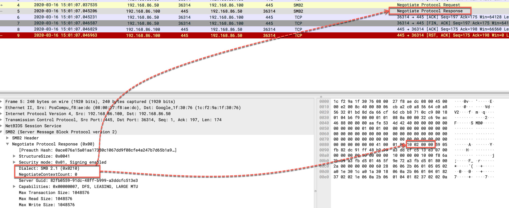
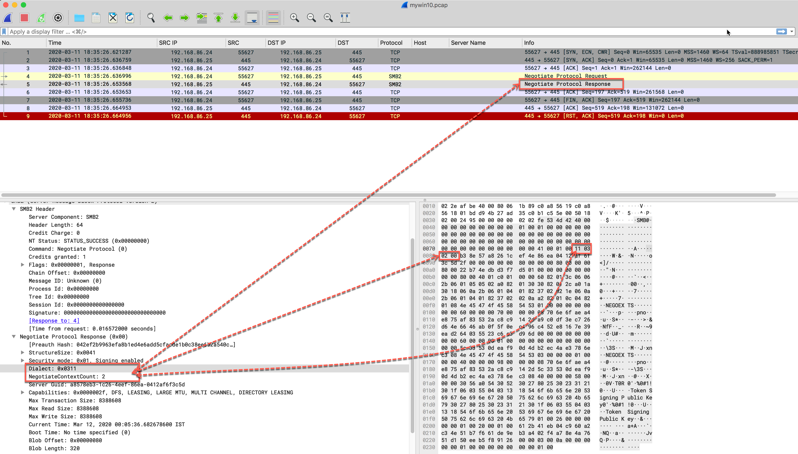
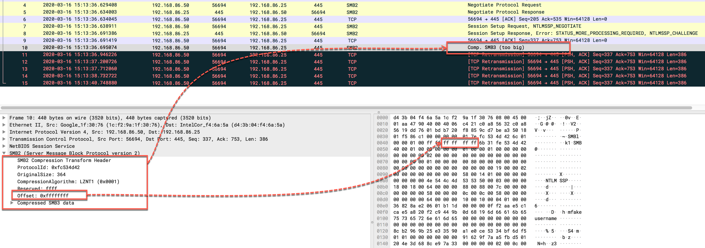

# SMBGhost aka CoronaBlue

Of late Microsoft has released an advisory fixing a critical bug for Windows 10 operating systems. This bug could potentially be used for remote code execution and the fact which makes it even more critical is that, you really don't need to be an authenticated user. Windows7 and older OS variants are not exploitable to this bug. We would recommend to visit this [link](https://portal.msrc.microsoft.com/en-US/security-guidance/advisory/CVE-2020-0796) and install the patches immediately without any further delay.

Let's dig little bit deeper to understand what happens when you want to:
1. fingerpint list of potential exploitable hosts
2. trigger the buffer overflow bug into the target host


## Target identification

During the initial scanning phase, Client sends a Negotiate Protocol Request asking server about the capabilities of the target Windows workstation to verify whether it supports Data Compression for the subsequent transactions along with a SMB2_COMPRESSION_CAPABILITIES header (24 bytes). Now the target Windows workstation responds back with the host's capabilities which ultimately determines whether this host is exploitable to this bug or not.


* #### ***Protocol behaviour, when host is non-exploitable i.e. Win7_x64***

    **PDU Type:** Negotiate Protocol Response (Filter: smb2.cmd == 0 && smb2.flags.response == 1)

    ```
    Dialect (2 Bytes):                  0x0210 (SMB 2.1)
    NegotiateContextCount (2 bytes):    0x0000
    ```

    > **PCAP:** win7_not_vulnerable.pcap

    Below screenshot demonstates the scanning behavior when a non-vulnerable host is found:

    


* #### ***Protocol behaviour, when host is exploitable i.e. Win10_x64 Build 18362***

    **PDU Type:** Negotiate Protocol Response (Filter: smb2.cmd == 0 && smb2.flags.response == 1)

    ```
    Dialect (2 Bytes):                  0x0311 (SMB 3.1.1)
    NegotiateContextCount (2 bytes):    0x0200 or 0x0300
    ```

    > **PCAP:**  win10_vulnerable.pcap

    Below screenshot demonstates the scanning behavior when a non-vulnerable host is found:

    


## Triggering the bug/crash

Once the attacker finds (from the above scanning method) a potential exploitable host, attacker could send a crafted malicious request to trigger the DOS on the target host. Following parameters must hold true to trigger this crash:


**PDU Type:** *SMB2 Compression Transform header*

```
ProtocolID (2 bytes):               0xfc534d42 (must)
OriginalSize (4 bytes):             Length of compressed SMB3 Data (variable)
CompressionAlgorithm (2 bytes):     LZNT1 (must be set to 0x0001)
Reserved (2 bytes):                 0xffff
Offset (4 bytes):                   0xffffffff (A higher value which means -1 when represented as signed long.)
```

> **Offset** field is the root cause to trigger crash on the target OS as this field lacks bounds checking while allocating buffer size to hold this data. Subsequently with some more additional effort, RCE should be achievable however as of now, there are no exploit codes available that demonstrates this ability. However we believe it should be available to the public soon.

Below screenshot demonstrates the attack data used during crash:




## PCAPs

* win7_crash_false.pcap [Win7, no crash]
* win10_crash_true.pcap [Win10, triggers BSOD]
* win7_not_vulnerable.pcap [Win7 target scanning, returing result as non-exploitable]
* win10_vulnerable.pcap [Win10 target scanning, returning result as exploitable]


## Reference
* Scanner Modules
    * [Nmap scripts](https://github.com/ClarotyICS/CVE2020-0796/tree/master/nse_script)
    * Python scripts
        * [OllyPwn](https://github.com/ollypwn/SMBGhost/blob/master/scanner.py)
        * [Claroty ICS](https://github.com/ClarotyICS/CVE2020-0796/blob/master/python_script/smbv3_compress.py)
* Crash POC
    * [EeryKitty GitHub](https://github.com/eerykitty/CVE-2020-0796-PoC)
